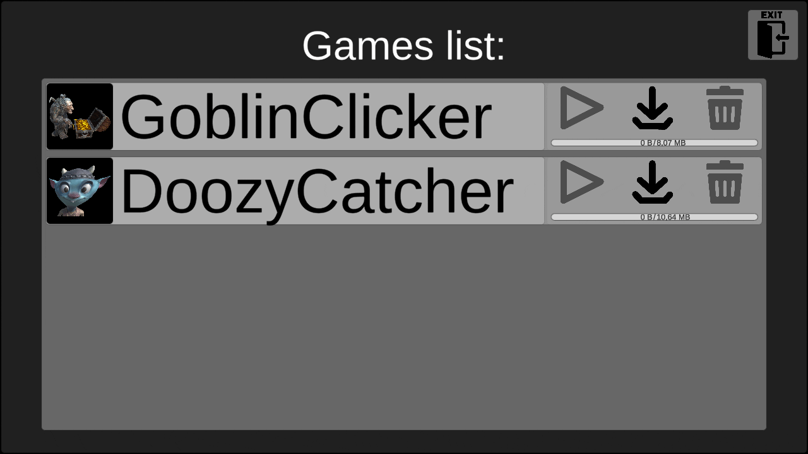
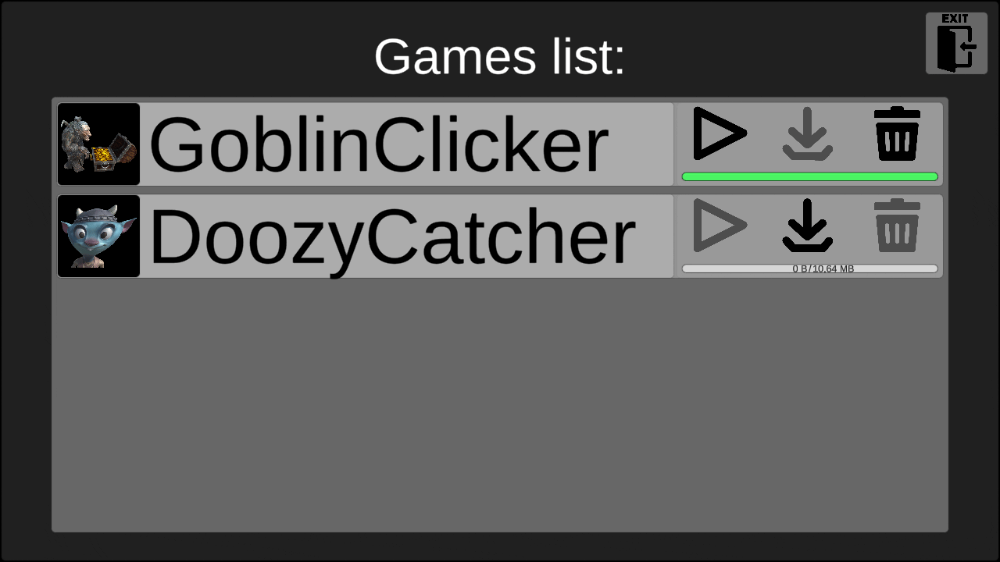

# GameLauncher

**GameLauncher** is a simple example of using Addressables in Unity to make a game *lightweight* and only load the necessary content

## Gameplay

### GoblinClicker

### DoozyCatcher

